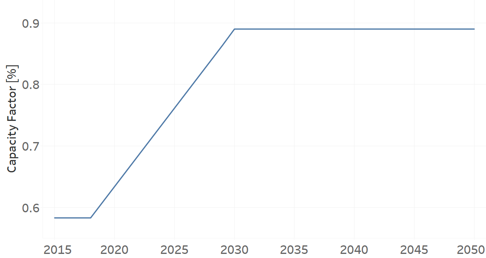

PPGEO001
=====================================

+-------------------------------------------------+-------+--------------+--------------+--------------+--------------+
| .. figure:: img/PPGEO.jpg                                                                                           |
|    :align:   center                                                                                                 |
|    :width:   500 px                                                                                                 |
+-------------------------------------------------+-------+--------------+--------------+--------------+--------------+
| Set codification:                                       |PPGEO001                                                   |
+-------------------------------------------------+-------+--------------+--------------+--------------+--------------+
| Description:                                            |Geothermal Power Plant (existing)                                 |
+-------------------------------------------------+-------+--------------+--------------+--------------+--------------+
| Set:                                                    |Technology                                                 |
+-------------------------------------------------+-------+--------------+--------------+--------------+--------------+
| Parameter                                       | Unit  | 2020         | 2030         | 2040         |  2050        |
+=================================================+=======+==============+==============+==============+==============+
| CapacityFactor[r,t,l,y] (Dry)                   |   %   | 0.634        | 0.634        | 0.634        | 0.634        |
+-------------------------------------------------+-------+--------------+--------------+--------------+--------------+
| CapacityFactor[r,t,l,y] (Rain)                  |   %   | 0.634        | 0.634        | 0.634        | 0.634        |
+-------------------------------------------------+-------+--------------+--------------+--------------+--------------+
| FixedCost[r,t,y]                                | M$/GW | 44.5         | 44.5         | 44.5         | 44.5         |
+-------------------------------------------------+-------+--------------+--------------+--------------+--------------+
| InputActivityRatio[r,t,f,m,y] (Geothermal       | PJ/PJ | 2.85         | 2.85         | 2.85         | 2.85         |
| energy)                                         |       |              |              |              |              |
+-------------------------------------------------+-------+--------------+--------------+--------------+--------------+
| OperationalLife[r,t]                            |  Años | 40           | 40           | 40           | 40           |
+-------------------------------------------------+-------+--------------+--------------+--------------+--------------+
| OutputActivityRatio[r,t,f,m,y] (Electricity     | PJ/PJ | 1            | 1            | 1            | 1            |
| Supply by Plants)                               |       |              |              |              |              |
+-------------------------------------------------+-------+--------------+--------------+--------------+--------------+
| ResidualCapacity[r,t,y]                         |  GW   | 0.206        | 0.206        | 0.206        | 0.206        |
+-------------------------------------------------+-------+--------------+--------------+--------------+--------------+
| TotalAnnualMaxCapacity[r,t,y]                   |  GW   | 0.206        | 0.206        | 0.206        | 0.206        |
+-------------------------------------------------+-------+--------------+--------------+--------------+--------------+
| VariableCost[r,t,m,y]                           | M$/PJ | 0.001        | 0.001        | 0.001        | 0.001        |
+-------------------------------------------------+-------+--------------+--------------+--------------+--------------+

CapacityFactor[r,t,l,y]
+++++++++
La figura 1 muestra el Capacity Factor para PPGEO001, para todos los escenarios y temporadas.

   
   *Figura 1) Capacity Factor de PPGEO001.*

Source:
   This is the source. 
   
Description: 
   This is the description. 

FixedCost[r,t,y]
+++++++++
La ecuación (1) muestran el Fixed Cost para PPGEO001, para todos los escenarios.

FixedCost=44.5   (1)

Source:
   This is the source. 
   
Description: 
   This is the description.
   
InputActivityRatio[r,t,f,m,y]
+++++++++
La ecuación (2) muestra el Input Activity Ratio para PPGEO001, para todos los escenarios y asociado al fuel Geothermal Energy.

InputActivityRatio=2.85   (2)

Source:
   This is the source. 
   
Description: 
   This is the description.   
   
OperationalLife[r,t]
+++++++++
La ecuación (3) muestra el Operational Life para PPGEO001, para todos los escenarios.

OperationalLife=40   (3)

Source:
   This is the source. 
   
Description: 
   This is the description.   
   
OutputActivityRatio[r,t,f,m,y]
+++++++++
La ecuación (4) muestra el Output Activity Ratio para PPGEO001, para todos los escenarios y asociado al fuel Electricity Supply by Plants.

OutputActivityRatio=1   (4)

Source:
   This is the source. 
   
Description: 
   This is the description.      
   
ResidualCapacity[r,t,y]
+++++++++
La ecuación (5) muestra el Residual Capacity para PPGEO001, para todos los escenarios.

ResidualCapacity=0.206   (5)

Source:
   This is the source. 
   
Description: 
   This is the description.         
   
TotalAnnualMaxCapacity[r,t,y]
+++++++++
La ecuación (6) muestra el Total Annual Max Capacity para PPGEO001, para todos los escenarios.

TotalAnnualMaxCapacity=0.206   (6)

Source:
   This is the source. 
   
Description: 
   This is the description.            
   
VariableCost[r,t,m,y]
+++++++++
La ecuación (7) muestra el Variable Cost para PPGEO001, para todos los escenarios.

VariableCost=0.001   (7)

Source:
   This is the source. 
   
Description: 
   This is the description. 
