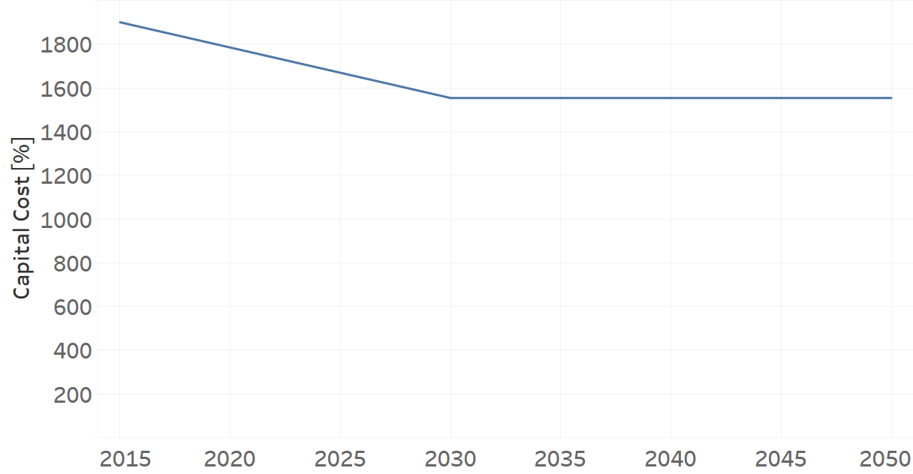
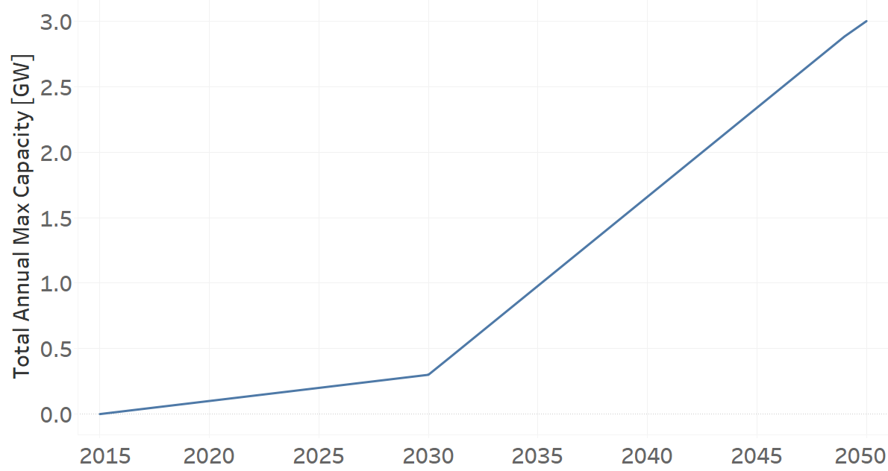

PPPVD002
=====================================

+-------------------------------------------------+-------+--------------+--------------+--------------+--------------+
| .. figure:: img/PPPVD.jpg                                                                                           |
|    :align:   center                                                                                                 |
|    :width:   500 px                                                                                                 |
+-------------------------------------------------+-------+--------------+--------------+--------------+--------------+
| Set codification:                                       |PPPVD002                                                   |
+-------------------------------------------------+-------+--------------+--------------+--------------+--------------+
| Description:                                            |Photovoltaic Power Plant Distribution (new)                |
+-------------------------------------------------+-------+--------------+--------------+--------------+--------------+
| Set:                                                    |Technology                                                 |
+-------------------------------------------------+-------+--------------+--------------+--------------+--------------+
| Parameter                                       | Unit  | 2020         | 2030         | 2040         |  2050        |
+=================================================+=======+==============+==============+==============+==============+
| CapacityFactor[r,t,l,y] (Dry)                   |   %   | 0.227        | 0.227        | 0.227        | 0.227        |
+-------------------------------------------------+-------+--------------+--------------+--------------+--------------+
| CapacityFactor[r,t,l,y] (Rain)                  |   %   | 0.227        | 0.227        | 0.227        | 0.227        |
+-------------------------------------------------+-------+--------------+--------------+--------------+--------------+
| CapitalCost[r,t,y]                              | %     | 1784.5       | 1553.5       | 1553.5       | 1553.5       |
+-------------------------------------------------+-------+--------------+--------------+--------------+--------------+
| FixedCost[r,t,y]                                | M$/GW | 15.6         | 15.6         | 15.6         | 15.6         |
+-------------------------------------------------+-------+--------------+--------------+--------------+--------------+
| InputActivityRatio[r,t,f,m,y] (Solar            | PJ/PJ | 1            | 1            | 1            | 1            |
| energy)                                         |       |              |              |              |              |
+-------------------------------------------------+-------+--------------+--------------+--------------+--------------+
| OperationalLife[r,t]                            |  Años | 20           | 20           | 20           | 20           |
+-------------------------------------------------+-------+--------------+--------------+--------------+--------------+
| OutputActivityRatio[r,t,f,m,y] (Electricity     | PJ/PJ | 1            | 1            | 1            | 1            |
| For Transmission)                               |       |              |              |              |              |
+-------------------------------------------------+-------+--------------+--------------+--------------+--------------+
| TotalAnnualMaxCapacity[r,t,y]                   |  GW   | 0.1          | 0.3          | 1.659        | 3            |
+-------------------------------------------------+-------+--------------+--------------+--------------+--------------+
| VariableCost[r,t,m,y]                           | M$/PJ | 0.001        | 0.001        | 0.001        | 0.001        |
+-------------------------------------------------+-------+--------------+--------------+--------------+--------------+

CapacityFactor[r,t,l,y]
+++++++++
La ecuación (1) muestra el Capacity Factor para PPPVD002, para todos los escenarios y temporadas.

CapacityFactor=0.227%   (1)

Source:
   This is the source. 
   
Description: 
   This is the description. 
   
CapitalCost[r,t,y]
+++++++++
La Figura 1 muestra el Capital Cost para PPPVD002, para todos los escenarios.

   
   *Figura 1) Capital Cost de PPPVD002.*

Source:
   This is the source. 
   
Description: 
   This is the description.

FixedCost[r,t,y]
+++++++++
La ecuación (2) muestran el Fixed Cost para PPPVD002, para todos los escenarios.

FixedCost=15.6 [M$/GW]   (2)

Source:
   This is the source. 
   
Description: 
   This is the description.
   
InputActivityRatio[r,t,f,m,y]
+++++++++
La ecuación (3) muestra el Input Activity Ratio para PPPVD002, para todos los escenarios y asociado al fuel Solar Energy.

InputActivityRatio=1   [PJ/PJ]   (3)

Source:
   This is the source. 
   
Description: 
   This is the description.
   
OperationalLife[r,t]
+++++++++
La ecuación (4) muestra el Operational Life para PPPVD002, para todos los escenarios.

OperationalLife=20 Años   (4)

Source:
   This is the source. 
   
Description: 
   This is the description.   
   
OutputActivityRatio[r,t,f,m,y]
+++++++++
La ecuación (5) muestra el Output Activity Ratio para PPPVD002, para todos los escenarios y asociado al fuel Electricity for Transmission.

OutputActivityRatio=1 [PJ/PJ]   (5)

Source:
   This is the source. 
   
Description: 
   This is the description. 
   
TotalAnnualMaxCapacity[r,t,y]
+++++++++
La figura 2 muestra el Total Annual Max Capacity para PPPVD002, para todos los escenarios.

   
   *Figura 2) Total Annual Max Capacity de PPPVD002.*

Source:
   This is the source. 
   
Description: 
   This is the description.
   
VariableCost[r,t,m,y]
+++++++++
La ecuación (6) muestra el Variable Cost para PPPVD002, para todos los escenarios.

VariableCost=0.001 [M$/PJ]   (6)

Source:
   This is the source. 
   
Description: 
   This is the description.    
